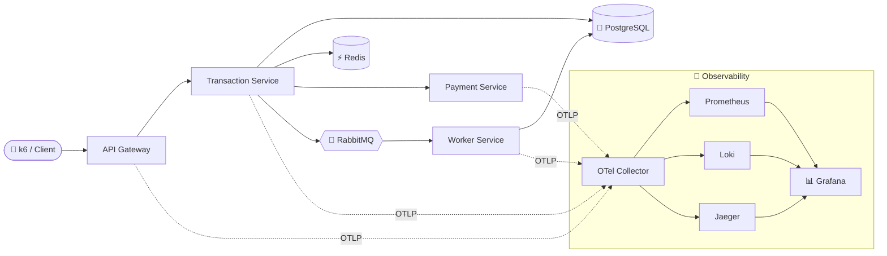

<div align="center">

# 🔭 TraceForge

### Observable Microservice Lab

**An experiment-first platform that _measures_ the real cost and debugging value of observability in a containerized microservice system.**

_Not another microservices demo — a controlled laboratory that produces repeatable measurements, comparison tables, and charts._

<br/>


[](https://doi.org/10.5281/zenodo.20561281)

</div>

---

## ✨ Why TraceForge?

Most "microservice projects" prove that an app _works_. TraceForge proves that a system can be **deployed, observed, measured, stressed, broken on purpose, and explained with evidence.**

It answers one core question with numbers, not opinions:

> **How much performance and resource overhead does observability add — and how much does it actually improve debugging and failure diagnosis?**

|                                 |                                                                                                                              |
| ------------------------------- | ---------------------------------------------------------------------------------------------------------------------------- |
| 🎚️ **One switch, five depths**  | A single `OBS_MODE` variable flips the whole stack between _no observability_ and a _full OpenTelemetry pipeline_.           |
| 📏 **Measurement from day one** | Every mode runs the same k6 load, captures Docker stats + telemetry volume, and computes overhead vs a baseline.             |
| 💥 **Break it on purpose**      | Six injectable faults (slow payment, errors, slow DB, dead consumer, Redis down, memory pressure) for debuggability studies. |
| 📊 **Real artifacts**           | Repeatable CSVs, dependency-free SVG charts, and analysis reports — not screenshots.                                         |
| 🧱 **Clean architecture**       | pnpm monorepo, ports-and-adapters services, shared typed packages, strict TypeScript, CI.                                    |

---

## 🏗️ Architecture



**The request path:** `POST /transactions` → API Gateway → Transaction Service → **PostgreSQL write → Redis cache → Payment Service → RabbitMQ publish → Worker consume → event persisted.** One flow that crosses HTTP, SQL, cache, and async messaging — enough surface area to measure something real.

| Service                | Package                           |   Port | Role                                      |
| ---------------------- | --------------------------------- | -----: | ----------------------------------------- |
| 🚪 API Gateway         | `@traceforge/api-gateway`         | `3000` | Public API, correlation/trace propagation |
| 💳 Transaction Service | `@traceforge/transaction-service` | `3001` | Core flow, Postgres + Redis + RabbitMQ    |
| 🏦 Payment Service     | `@traceforge/payment-service`     | `3002` | Simulated payment + fault injection       |
| ⚙️ Worker Service      | `@traceforge/worker-service`      | `3003` | Consumes events, persists them            |

---

## 🔭 Observability Modes

Flip the entire telemetry depth with one environment variable. Every layer cleanly degrades to a no-op when disabled.

| `OBS_MODE`            | Metrics | Logs | Traces | Collector | Purpose                                      |
| --------------------- | :-----: | :--: | :----: | :-------: | -------------------------------------------- |
| `none`                |   ⬜    |  ⬜  |   ⬜   |    ⬜     | Raw baseline                                 |
| `metrics`             |   ✅    |  ⬜  |   ⬜   |    ⬜     | Prometheus only                              |
| `metrics_logs`        |   ✅    |  ✅  |   ⬜   |    ⬜     | + structured logs & correlation IDs (Loki)   |
| `metrics_logs_traces` |   ✅    |  ✅  |   ✅   |    ⬜     | + distributed tracing (Jaeger)               |
| `otel_full`           |   ✅    |  ✅  |   ✅   |    ✅     | Everything routed through the OTel Collector |

---

## 🧪 What It Measures — Sample Findings

The **realistic load campaign** (`pnpm load:run`, open-model, **N=10 per mode**) feeds the statistics pipeline (`STATS_DATASET=load pnpm stats:report`) for non-parametric analysis with bootstrap CIs. The headline RQ1 result:

| Mode              | Median CPU % [95% CI] | CPU overhead | Median p50 (ms) | Differs from baseline?     |
| ----------------- | --------------------- | -----------: | --------------: | -------------------------- |
| 🟢 Baseline       | 5.6 [5.3, 7.2]        |            — |            1.72 | —                          |
| 📈 Metrics        | 8.3 [5.2, 13.6]       |         +48% |            2.71 | **no** (CIs overlap; p≈.3) |
| 📝 Metrics + Logs | 14.9 [13.7, 19.6]     |    **+164%** |            4.77 | **yes** (p<0.001, δ=1.0)   |
| 🔗 + Traces       | 8.9 [8.2, 13.2]       |         +59% |            2.89 | yes (p=0.003)              |
| 🛰️ Full OTel      | 8.5 [7.2, 9.6]        |         +51% |            3.33 | yes (p<0.001)              |

> 💡 **Takeaway:** **metrics are essentially free** (not statistically distinguishable from baseline), **structured logging is the dominant cost** (+164% CPU, +177% p50, with severe tail spikes), and the **batched OpenTelemetry pipeline stays smooth** despite carrying the most telemetry — all backed by N=10, bootstrap CIs, Kruskal–Wallis, Mann–Whitney U, and Cliff's δ.

📄 **Read the full write-up:** the journal manuscript draft is [`docs/manuscript.md`](docs/manuscript.md); the engineering report is [`docs/final-report.md`](docs/final-report.md) (§6.0 = primary result), with all tables and box plots in [`docs/statistics-load-report.md`](docs/statistics-load-report.md) and the literature review in [`docs/related-work.md`](docs/related-work.md).

---

## 💥 Failure Injection & Debuggability

Six faults, all **off by default**, toggled by environment variables — paired with a manual debugging protocol that measures _time-to-detect_ and _time-to-root-cause_ across observability modes.

| ID  | Scenario             | Inject with                                           | Symptom              | Best tool           |
| --- | -------------------- | ----------------------------------------------------- | -------------------- | ------------------- |
| F1  | 🐌 Slow payment      | `PAYMENT_MODE=slow PAYMENT_DELAY_MS=1000`             | high latency         | traces              |
| F2  | 🔴 Payment errors    | `PAYMENT_ERROR_RATE=0.2`                              | error spike          | metrics + logs      |
| F3  | 🐢 Slow DB query     | `DB_SLOW_QUERY=true`                                  | p95 increase         | traces + DB metrics |
| F4  | 🧊 Consumer stopped  | `WORKER_DISABLED=true`                                | queue lag            | metrics             |
| F5  | ⚡ Redis unavailable | `REDIS_DISABLED=true`                                 | cache miss + latency | logs + metrics      |
| F6  | 🧠 Memory pressure   | `MEMORY_PRESSURE_ENABLED=true MEMORY_PRESSURE_MB=256` | latency/error growth | metrics             |

➡️ Protocol & schema: `docs/failure-injection-protocol.md` · Generate the report: `pnpm failure:report`

**Objective detection (`pnpm mttd:run`):** rather than a subjective timing, MTTD is measured as the time from fault onset to Prometheus **alert firing**. A real result — the fault is severe but **invisible without metrics**:

| Fault             | Baseline (no metrics)         |        Metrics (alert) |
| ----------------- | ----------------------------- | ---------------------: |
| 🔴 Payment errors | 12% errors, **undetected**    |  pending 9s · fire 70s |
| 🐌 Slow payment   | p95 ≈ 1007 ms, **undetected** | pending 10s · fire 72s |

> 🔬 A **step change, not a gradient**: observability converts an undetectable fault into one detected within ~one scrape interval. See [`docs/mttd-report.md`](docs/mttd-report.md).

---

## 🗃️ Database Indexing Experiments

`pnpm indexing:run` seeds **1,000,000 transactions** (research-grade) across 100k users and captures real `EXPLAIN (ANALYZE, BUFFERS)` plans across **7 index strategies × 5 query patterns (35 combinations)**, with **bootstrap 95% CIs** on the p95 query time and read-improvement vs write-penalty reported separately. A real result from this repo:

| Query                          | Best strategy            | p95: no-index → indexed | Improvement |
| ------------------------------ | ------------------------ | ----------------------: | ----------: |
| Q1 user history                | `(user_id, …)` composite |   24.5 ms → **0.11 ms** |  **+99.6%** |
| Q4 user + status + time        | `(user_id, status, …)`   |   20.0 ms → **0.04 ms** |  **+99.8%** |
| Q2 `status='failed'` + time    | `(status, created_at)`   |   25.4 ms → **13.5 ms** |    **+47%** |
| Q3 high-value (`amount` unidx) | none helps (seq scan)    |        full 1M-row scan |         ~0% |

> 💡 **Takeaway:** indexes matching the query's leading columns turn **1M-row** sequential scans into ~16-row index lookups, but every index adds **+19% (partial) to +322% (3-column) write latency** — the read-vs-write trade-off, measured at scale with bootstrap 95% CIs. Full tables, charts, and raw plans: [`docs/postgres-indexing-report.md`](docs/postgres-indexing-report.md).

The same experiment runs on **MongoDB** (`pnpm indexing:mongo`, 6 strategies × 4 queries via `explain("executionStats")`), and `pnpm sql-nosql:report` produces a careful **SQL-vs-NoSQL comparison** that leads with the structural metric (rows/documents examined) — the apples-to-apples signal — with latency treated as indicative only (both engines at **1M rows/documents**):

| Query (structural)   | PostgreSQL best  | examined | MongoDB best | examined |
| -------------------- | ---------------- | -------: | ------------ | -------: |
| Q1 user history      | `I6` Bitmap Heap |  16 rows | `M5` IXSCAN  |  11 docs |
| Q2 `status='failed'` | `I5` Bitmap Heap |   27,740 | `M4` IXSCAN  |   27,553 |
| Q4 user+status+time  | `I6` Index Scan  |   5 rows | `M5` IXSCAN  |   4 docs |

> 🔬 Both engines reduce work along the same structural lines. Per the project's anti-goals, **no "X is faster than Y"** claim is made — conclusions are scoped to this dataset, access pattern, and hardware. See [`docs/mongodb-indexing-report.md`](docs/mongodb-indexing-report.md) and [`docs/sql-nosql-comparison.md`](docs/sql-nosql-comparison.md).

---

## 🧭 Orchestration: Compose vs Swarm vs Kubernetes

`pnpm orchestration:run` deploys the same core stack on **Docker Compose** and **Docker Swarm**, measuring startup, scaling, recovery, and resource overhead live. The Kubernetes manifests are authored and validated (`kubeconform`, 19/19 resources) but not run here (no local cluster). A real result:

| Target         | Startup | Scale a service       | Recover a killed instance  | Config (core) |
| -------------- | ------: | --------------------- | -------------------------- | ------------: |
| 🐳 Compose     |   ~34 s | ❌ host-port conflict | ❌ none (not a reconciler) |     superset¹ |
| 🐝 Swarm       |   ~25 s | ✅ routing mesh (1→3) | ✅ auto-reschedule (~15 s) |     123 lines |
| ☸️ Kubernetes² |     n/a | ✅ HPA in manifest    | ✅ ReplicaSet controller   |     356 lines |

> 💡 **Takeaway:** Compose is the simplest to start but is not an orchestrator — it can't scale a host-port-published service and won't restart a killed container. Swarm adds a small `deploy` block and gets the routing mesh + self-healing. Kubernetes offers the strongest primitives for the most configuration. Full tables and charts: [`docs/orchestration-comparison.md`](docs/orchestration-comparison.md).
>
> ¹ The Compose file includes the observability profiles (superset); the fair core-only comparison is Swarm (123) vs Kubernetes (356). ² Kubernetes is authored + statically validated, not run in this environment.

---

## 🚀 Quick Start

```bash
# 1. Install & verify
pnpm install
pnpm test          # 42 unit tests
pnpm typecheck
pnpm lint
pnpm build

# 2. Start the base stack (Postgres, Redis, RabbitMQ + services)
docker compose -f infra/docker/compose/docker-compose.base.yml up --build -d
pnpm migrate:postgres
pnpm seed:postgres

# 3. Create a transaction
curl -X POST http://localhost:3000/transactions \
  -H "content-type: application/json" \
  -d '{"userId":"user-1","amount":42,"currency":"USD","description":"Demo"}'
```

Run services locally in watch mode instead: `pnpm dev`

---

## 🔬 Running the Experiments

Each observability mode runs the **same** k6 scenario 3×, samples Docker stats, captures telemetry volume, and writes raw + processed + report artifacts.

<details>
<summary><b>Per-mode experiment commands</b></summary>

```bash
# Phase 3 — Baseline (no observability)
OBS_MODE=none pnpm baseline:run

# Phase 4 — Metrics
OBS_MODE=metrics docker compose -f infra/docker/compose/docker-compose.base.yml --profile metrics up --build -d
pnpm migrate:postgres && pnpm metrics:run

# Phase 5 — Metrics + Logs
OBS_MODE=metrics_logs docker compose -f infra/docker/compose/docker-compose.base.yml --profile metrics --profile logs up --build -d
pnpm migrate:postgres && pnpm metrics-logs:run

# Phase 6 — Metrics + Logs + Traces
OBS_MODE=metrics_logs_traces docker compose -f infra/docker/compose/docker-compose.base.yml --profile metrics --profile logs --profile traces up --build -d
pnpm migrate:postgres && pnpm metrics-logs-traces:run

# Phase 7 — Full OpenTelemetry pipeline
OBS_MODE=otel_full OTEL_EXPORTER_OTLP_ENDPOINT=http://otel-collector:4318 \
  docker compose -f infra/docker/compose/docker-compose.base.yml --profile metrics --profile logs --profile traces --profile otel up --build -d
pnpm migrate:postgres && pnpm otel-full:run

# Phase 8 — Aggregate all modes into one comparison (no containers needed)
pnpm overhead:report
```

</details>

<details>
<summary><b>Load profiles & failure scenarios (k6)</b></summary>

```bash
# Load profiles — drive the same flow at different shapes
k6 run load-tests/k6/smoke.js
k6 run load-tests/k6/stress.js                       # 50→100→200→500 VUs
k6 run load-tests/k6/spike.js                        # 10→300→10 VUs
k6 run -e VUS=100 -e DURATION=60m load-tests/k6/soak.js

# Failure scenarios — start the stack with a fault flag, then drive load
k6 run load-tests/k6/failure-payment-slow.js
k6 run load-tests/k6/failure-payment-errors.js
k6 run load-tests/k6/failure-db-slow.js
k6 run load-tests/k6/failure-rabbitmq-consumer.js
k6 run load-tests/k6/failure-redis.js

pnpm failure:report                                  # detection / root-cause report + charts
```

</details>

**Dashboards when the stack is up:** Grafana `:3004` · Prometheus `:9090` · Jaeger `:16686` · RabbitMQ `:15674`

---

## 📊 Results & Artifacts

```text
results/
├── raw/         # k6 summaries, Docker stats, telemetry-volume JSON per run
├── processed/   # comparison CSVs (observability-overhead, debuggability)
└── charts/      # dependency-free SVG charts (latency, CPU, memory, overhead, volumes)

docs/
├── observability-overhead-report.md     # Phase 8 cross-mode analysis
├── failure-injection-report.md          # Phase 9 debuggability report
└── failure-injection-protocol.md        # manual measurement protocol
```

---

## 🧱 Shared Packages

| Package                 | Purpose                                                            |
| ----------------------- | ------------------------------------------------------------------ |
| `@traceforge/contracts` | Shared types, constants, and request validation                    |
| `@traceforge/config`    | Typed env parsing — service, runtime, telemetry & **fault** config |
| `@traceforge/logger`    | Structured JSON logs, correlation IDs, Loki/OTLP export            |
| `@traceforge/metrics`   | Prometheus registry + HTTP/DB/Redis/RabbitMQ instruments           |
| `@traceforge/tracing`   | OpenTelemetry SDK, W3C context propagation, span helpers           |

---

## 🗺️ Roadmap

**v1.0 — _Observability Laboratory_ (current)** covers the full measurement story end-to-end:

| ✅  | Phase  |                                                                                                                      |
| :-: | ------ | -------------------------------------------------------------------------------------------------------------------- |
| ✅  | **0**  | Research design — questions, hypotheses, KPIs                                                                        |
| ✅  | **1**  | Monorepo & service foundation                                                                                        |
| ✅  | **2**  | Core business flow (HTTP + SQL + cache + async)                                                                      |
| ✅  | **3**  | Baseline without observability                                                                                       |
| ✅  | **4**  | Metrics                                                                                                              |
| ✅  | **5**  | Metrics + Logs                                                                                                       |
| ✅  | **6**  | Metrics + Logs + Traces                                                                                              |
| ✅  | **7**  | Full OpenTelemetry pipeline                                                                                          |
| ✅  | **8**  | Observability-overhead experiments & charts                                                                          |
| ✅  | **9**  | Failure injection & debuggability tooling                                                                            |
| ✅  | **13** | **Final report & paper draft** — [`final-report.md`](docs/final-report.md) · [`paper-draft.md`](docs/paper-draft.md) |

**Post-v1 research (in progress):**

| ✅  | Phase  |                                                                                                                                                               |
| :-: | ------ | ------------------------------------------------------------------------------------------------------------------------------------------------------------- |
| ✅  | **10** | PostgreSQL indexing experiments — [`postgres-indexing-report.md`](docs/postgres-indexing-report.md)                                                           |
| ✅  | **11** | MongoDB / SQL-vs-NoSQL indexing — [`mongodb-indexing-report.md`](docs/mongodb-indexing-report.md) · [`sql-nosql-comparison.md`](docs/sql-nosql-comparison.md) |
| ✅  | **12** | Compose vs Swarm vs Kubernetes orchestration — [`orchestration-comparison.md`](docs/orchestration-comparison.md)                                              |

> 🔭 **Optional extensions:** running the Kubernetes manifests on a local cluster, and per-target k6 load tests.

---

## 🧰 Tech Stack

**Backend** NestJS · TypeScript (strict) · pnpm workspaces
**Data** PostgreSQL · MongoDB · Redis · RabbitMQ
**Observability** OpenTelemetry · Prometheus · Grafana · Loki · Jaeger
**Load & Orchestration** k6 · Docker Compose

---

## 🔁 Reproducibility & Citation

Every figure, table, and dataset is **regenerable from source**. The exact
environment (hardware, runtimes, image digests) is recorded by `pnpm env:capture` into
`results/environment.json`, and the full reproduction guide — prerequisites, a
command for every result, determinism/seeds, and a data-availability statement — is in
[`docs/reproducibility.md`](docs/reproducibility.md).

To cite this work, use [`CITATION.cff`](CITATION.cff) (GitHub's "Cite this repository"
button). A versioned, DOI-archived snapshot is on Zenodo:
**[10.5281/zenodo.20561281](https://doi.org/10.5281/zenodo.20561281)**.

## 📜 License

- **Code** — [MIT](LICENSE).
- **Experimental data & figures** (`results/` and the generated reports) —
  [CC-BY-4.0](https://creativecommons.org/licenses/by/4.0/).

<div align="center">

**Built as a measurement system from day one.** 🔭

</div>
